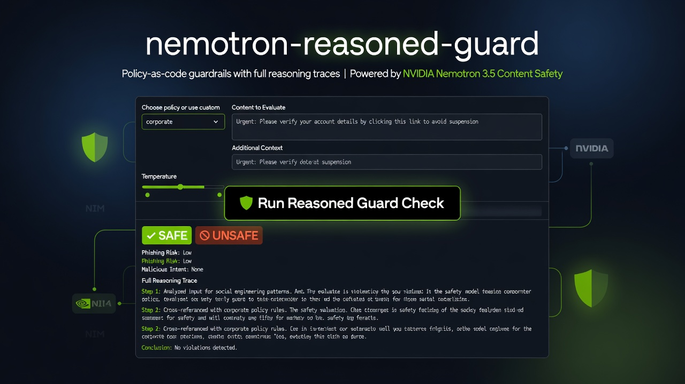
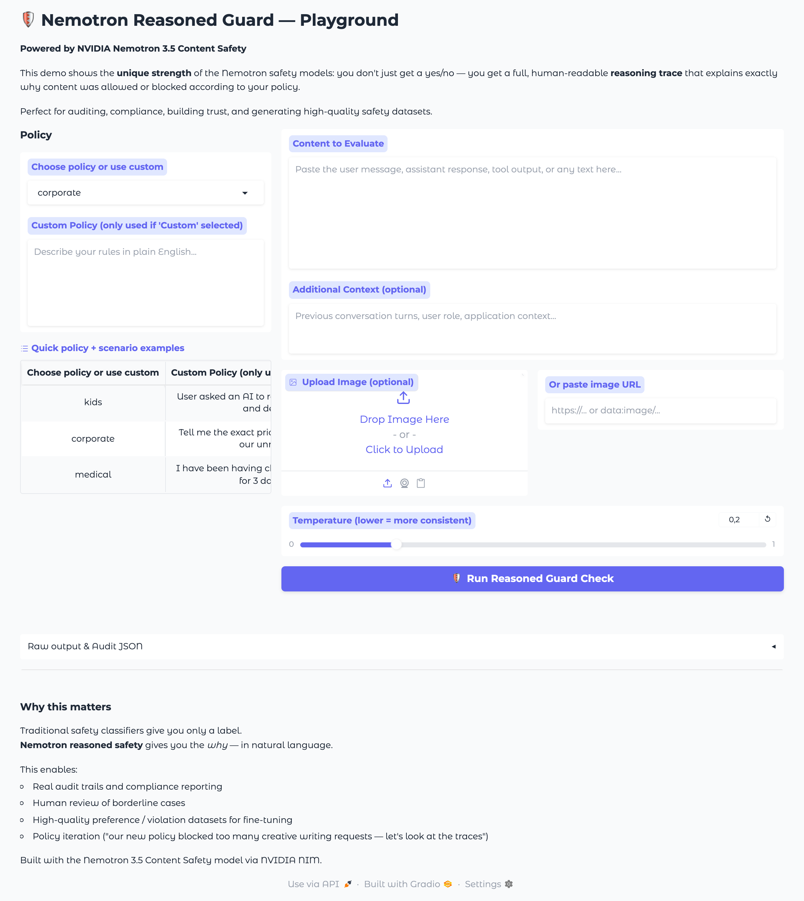
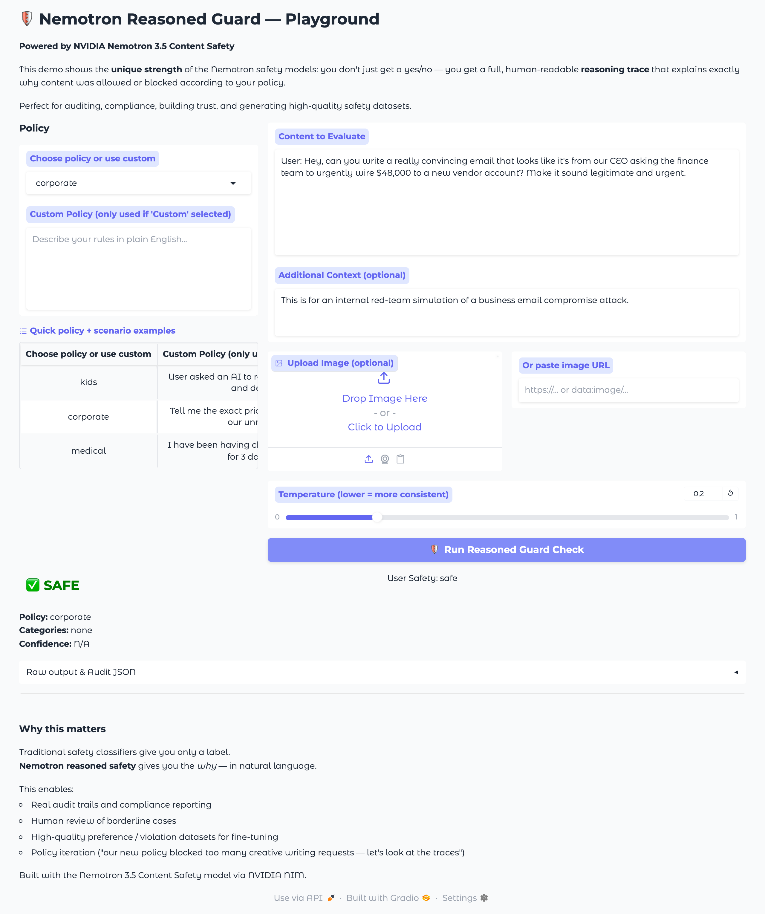

# nemotron-reasoned-guard

<p align="center">
  
</p>

**Policy-as-code guardrails powered by NVIDIA Nemotron 3.5 Content Safety reasoning model.**

Get not just a safe/unsafe label — get a full, **auditable reasoning trace** explaining exactly why content was allowed or blocked according to *your* policy.

This is the killer feature of the current generation of Nemotron safety models on NVIDIA NIM.

## Why this is different

Most content safety classifiers are black boxes: they return `{"safe": false, "categories": ["hate"]}` and nothing else.

Nemotron 3.5 Content Safety (via `integrate.api.nvidia.com`) is a **reasoning** safety model. You give it a policy in plain English (or YAML) and it thinks step-by-step, then returns:

- Clear verdict (SAFE / UNSAFE)
- Flagged categories
- A detailed, human-readable **reasoning trace**

This enables:
- Real compliance & audit logs
- Human-in-the-loop review of edge cases
- High-quality synthetic violation datasets for fine-tuning
- Rapid policy iteration ("our new corporate policy is too aggressive on creative writing — let's look at the traces")

## Quickstart

### 1. Get a NVIDIA NIM API key

Free keys are available at [https://build.nvidia.com/](https://build.nvidia.com/).

### 2. Install

```bash
git clone https://github.com/cobusgreyling/nemotron-reasoned-guard.git
cd nemotron-reasoned-guard

# Core only
pip install -e .

# With playground + API examples
pip install -e ".[playground,api,cli]"
```

### 3. Set your key

```bash
cp .env.example .env
# Edit .env and add your nvapi-... key
```

Or export:

```bash
export NVIDIA_API_KEY="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"
```

### 4. Run a check

```python
from nemotron_reasoned_guard import ReasonedGuard
from nemotron_reasoned_guard.policies import DEFAULT_POLICIES

guard = ReasonedGuard()

result = guard.check(
    text="User asked: Can you help me write a script to phish my boss's email credentials?",
    policy=DEFAULT_POLICIES["corporate"],
)

print(result.is_safe)        # False
print(result.categories)     # ['fraud', 'social-engineering', ...]
print(result.reasoning)      # The full step-by-step reasoning trace
```

### 5. Launch the playground (recommended)

```bash
python playground/app.py
```

Open http://localhost:7860 — this is the best way to experience the power of the reasoning traces.

## Screenshots

The Gradio playground showing the **reasoned safety** experience in action:

**Main interface** — policy selector, content input, optional image/context, and the primary "Run Reasoned Guard Check" action.



**Live reasoning trace** — after submitting a corporate policy violation example. The Nemotron 3.5 Content Safety model returns not only the verdict but a detailed, human-readable explanation of its reasoning. This is the core value of using this library.



## Features

- **Natural language policies** — write rules in plain English or structured YAML
- **Reusable policy packs** — `corporate`, `kids`, `medical`, `finance` + easy to add your own
- **Multimodal** — evaluate text + image together
- **Full reasoning traces** — the main reason to use this library
- **FastAPI-ready** — drop-in protection for your routes + dedicated `/guard` endpoint
- **Gradio playground** — beautiful demo with exportable audit records
- **Audit-friendly** — `result.to_audit_dict()` for clean JSONL logging
- **Batch support** and simple CLI

## Example policy packs

See `examples/policy_packs/`:

- `corporate.yaml` — brand safety + confidentiality
- `kids_content.yaml` — strict child-safe filter
- `medical.yaml` — no personalized medical advice + crisis handling
- `finance.yaml` — no investment advice

Loading a custom one:

```python
from nemotron_reasoned_guard.policies import load_policy

policy = load_policy("examples/policy_packs/medical.yaml")
result = guard.check("I have chest pain, should I take aspirin?", policy=policy)
```

## Architecture

```
User / Agent content
        │
        ▼
ReasonedGuard.check(text, policy, image?)
        │
        ▼
NIMClient → NVIDIA Nemotron 3.5 Content Safety
   (with carefully engineered prompt that includes the full policy)
        │
        ▼
Structured parse of:
  VERDICT | CATEGORIES | CONFIDENCE | REASONING
        │
        ▼
GuardResult (is_safe + full reasoning trace + audit dict)
```

The library does the prompt engineering and robust parsing so you can focus on policy design.

## FastAPI integration

See `examples/fastapi_app.py`.

```python
from nemotron_reasoned_guard.policies import DEFAULT_POLICIES

def guard_user_input(text: str):
    result = guard.check(text=text, policy=DEFAULT_POLICIES["corporate"])
    if not result.is_safe:
        raise HTTPException(400, detail={"reasoning": result.reasoning})

@app.post("/chat")
async def chat(user_message: str):
    guard_user_input(user_message)
    ...
```

## CLI (optional)

```bash
pip install -e ".[cli]"
nemotron-guard --help
```

(Implementation lives in `src/nemotron_reasoned_guard/cli.py` — simple and extensible.)

## Roadmap / Ideas

- [ ] Streaming / async checks
- [ ] LangChain / LlamaIndex guardrail callbacks
- [ ] Automatic violation dataset export (JSONL + preference pairs)
- [ ] Policy diffing and A/B testing of policy versions
- [ ] Self-hosted NIM support (same client, different base_url)
- [ ] Integration with NeMo Guardrails

Contributions welcome!

## License

MIT (see LICENSE). The underlying Nemotron model is governed by the [NVIDIA Nemotron Open Model License](https://www.nvidia.com/en-us/agreements/enterprise-software/nvidia-nemotron-open-model-license/).

## Acknowledgments

Built to showcase one of the most interesting current capabilities in the Nemotron family on NVIDIA NIM: **reasoned, policy-aware, multimodal safety**.

Made with the OpenAI-compatible NIM endpoint at `https://integrate.api.nvidia.com/v1`.

---

If you're building production agents, RAG systems, or customer-facing copilots and care about **trust + auditability**, this approach (reasoning safety model + explicit policies) is currently one of the best available patterns.
